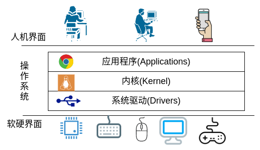

# 1. 搭建工作环境：选择内核、处理器与工具链

## 1.1. 认识嵌入式操作系统内核
### 1.1.1. 操作系统是什么

如果用一句话来形容操作系统，我想应该是“连接人类与计算机之间的桥梁”。准确的说，操作系统是帮助人类使用计算机的软件系统。比如说上网看个小视频吧，我们就需要跟很多硬件设备打交道。首先，我们需要一台显示器来播放图像；其次，我们需要一个音响来播放声音；除此之外，还需要一个网卡来上网，需要鼠标和键盘来点击链接输入网址。如果想要把视频下载下来随时观看的话，还得准备一个硬盘来保存视频数据。人们总是觉得能够上网看视频是计算机最基本的能力，很少有人会关注这样一个简单的功能背后的细节。正是站在我们和计算机之间的操作系统，做了大量的工作，为我们隐藏了那些硬件的工作原理，相互配合的流程细节，才使得人类能够轻松地使用计算机看小视频。

“操作系统是人类的好帮手”这种说法是站在我们使用者的角度来讲的。如果从计算机的立场出发，那么操作系统应该是“计算机的好管家”。从计算机的角度来看，“人类的要求真多，总让我干这干那的，整慢了还不高兴”。而且现如今人类指派的任务越来越复杂了，往往需要多个设备一起配合才能完成工作。比如刚刚提到的上网看小视频这个功能，就涉及了显示器、音响、网卡、鼠标、键盘、硬盘这些设备。除此之外，还有处理器、内存、各种总线、显卡、声卡……许多硬件需要管理。操作系统在这里就起到了一个资源管理器的作用。它负责协调各方面的工作，解决资源冲突的问题，尽可能的提高各个设备的使用效率。

这两个角度正是 Andrew S. Tanenbaum 在他的经典著作 《现代操作系统》中提到的操作系统的两个身份。从人类的视角来看，操作系统就是计算机的扩展(The Operating System as an Extended Machine)；从计算机的视角来看，则是资源管理器(The Operating System as Resource Manager)。如上图所示，操作系统正是由人机和软硬两个界面所包裹的软件系统。

大体上，操作系统可以拆分为内核、应用程序和系统驱动三个部分。很多人把操作系统和内核两个概念混用，在我看来是不合理的。**内核**的作用是对系统资源和工作任务进行抽象，提供通用的接口和编程框架，并没有实现什么具体的功能。脱离了应用程序和系统驱动，仅靠内核是不能让计算机为我们所用的。**系统驱动**直面各种硬件设备，保证它们能够正常工作，接受内核的管理和调度。各种**应用程序**为人类提供了丰富多样的服务，在内核的协调之下，满足了我们形式各样的需求。所以只有将内核、应用程序和系统驱动看做一个整体，才可以将之称为操作系统。

### 1.1.2. 嵌入式操作系统的特点
### 1.1.3. 内核要完成的工作
### 1.1.4. 内核的选择：微内核
## 1.2. 选择硬件平台
### 1.2.1. 计算机组成简介
### 1.2.2. ARM Cortex-M4处理器与STM32微控制器
### 1.2.3. 探索者STM32F407开发板
## 1.3. 搭建开发工具链
### 1.3.1. Linux系统环境及基本操作
### 1.3.2. 文本编辑器：VS Code
### 1.3.3. 交叉编译器：gcc-arm
### 1.3.4. 代码烧录器：OpenOCD
### 1.3.5. 在线调试器：GDB
## 1.4. 小结 

